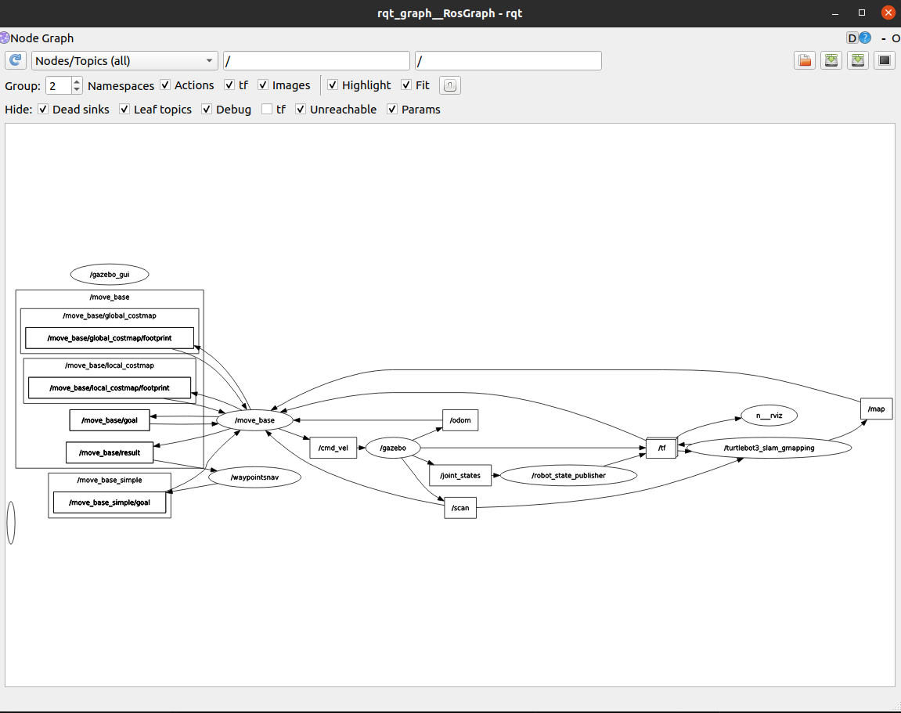

# Waypoint navigation : 

## Configuration :
* S'assurer que les paquets listés dans `pkgs.txt` sont biens installés (cmd pour lister les paquets ros `rospack list-names`) (faire un `rosdep install <nom_du_paquet>` le cas échéant)
* Faire les exports nécessaires pour que Gazebo puisse retrouver les variables/ressources nécessaires (présentes sur des paths différents du path de base)
    * `export GAZEBO_RESOURCE_PATH=$GAZEBO_RESOURCE_PATH:/path/to/world/repo/` 
    (exemple `export GAZEBO_RESOURCE_PATH=$GAZEBO_RESOURCE_PATH:/home/ehoa/catkin_ws/src/road_gen_simulation/world2/`).
    Le dossier `materials` contenant les scripts et textures doit être au niveau du path défini.
    * `export TURTLEBOT3_MODEL=waffle_pi` (burger, waffle, waffle_pi)

## Lancement de la simulation :
(La commande `rosrun` doit être lancée en dernier)
1. Terminal 1 : `roscore`
2. Terminal 2 : `roslaunch road_gen_simulation my_world.launch`
3. Terminal 3 : `rosrun road_gen_simulation waypoints.py`

Le déplacement repose sur le paquet `move_base` (http://wiki.ros.org/move_base) et les 
noeuds objectifs à atteindre sont publiés dans `"/move_base_simple/goal"`.

Je n'ai plus le temps de travailler sur ce projet et transmet donc les derniers éléments à corriger.
Dans le script `waypoint.py`, il faut préciser les deux derniers éléments du quaternion [x, y, z, w].
z et w sont dédiés à l'orientation et voici les ressources que j'ai trouvé pour le moment et qui pourraient être utiles.

https://answers.ros.org/question/314664/rotation-angle-in-pose-orientation/
https://answers.ros.org/question/220333/what-do-x-y-and-z-denote-in-mavros-topic-mavrosimudata_raw/#220356

La valeur pour l'orientation `float(e.attributes['o'].value[:3])` correspond au `yaw` en valeur absolue et doit être convertie en accord avec la représentation
du quaternion du package `move_base`.